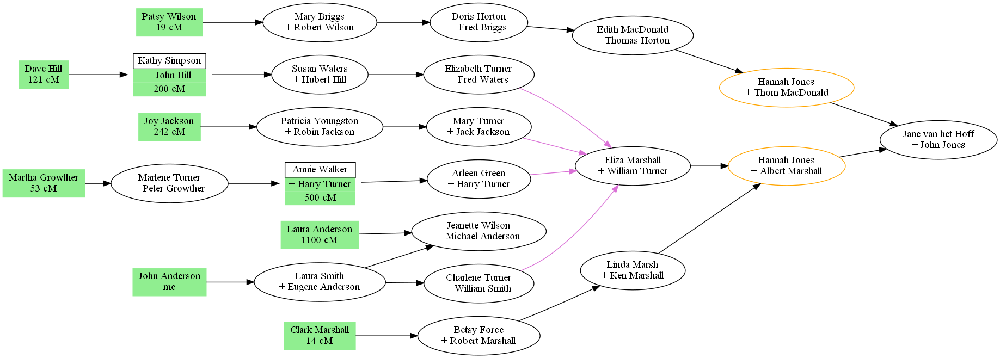

# draw-dna-matches.py

A program that can help with viewing DNA matched family members.

## Features

- Output is a [Graphviz](https://graphviz.org) DOT file.
- Makes use of [readgedcom.py](https://github.com/johnandrea/readgedcom) library.

## Limitations

- Requires Python 3.6+
- Might fail if the closest matched person does not have parents in the data file.

## Installation

No installation process. Copy the program and the library.

## Input

The input is a GEDCOM file exported from a genealogy program. The key is that
the DNA matches are marked in a custom event named 'dnamatch'. Optionally the match cM value will be extracted if found in that event's note field and will be
displayed below the person's name.

The relevant portion of the event should look like the following:

```
1 EVEN
2 TYPE dnamatch
2 NOTE matched at 732 cM
```

The matches are intended to be made against one person in the data file. That person
is identified by an event note which begins with the string "Me," or "me,".

```
1 EVEN
2 TYPE dnamatch
2 NOTE Me, matching others
```

## Options

The event name can be changed in the program by editing the value of the variable 'EVENT_NAME' near the top of the code.

The cM value in the note can be given as only a single number, or else it must be
a number followed by cM. Such as "62", "123cm", "text 123 cm", "1,234 cM", etc. However "text 321 text" will not match.

## Display

In the produced graphs, each dnamatch person will be shown in a green box. Any person which has multiple families will be in an orange bordered box. Any family
with 3 or more incoming connections will have coloured input arrows.

## Example



## Usage

```
./draw-dna-matches.py  family.ged  >out.dot  2>out.err
graphviz -Tpng out.dot -o out.png
graphviz -Tsvg out.dot -o out.svg
```

## Bug reports

This code is provided with neither support nor warranty.

### Future enhancements

- Handle non_ASCII names in a manner better for SVG output.
- Handle family matched above the tree top.
