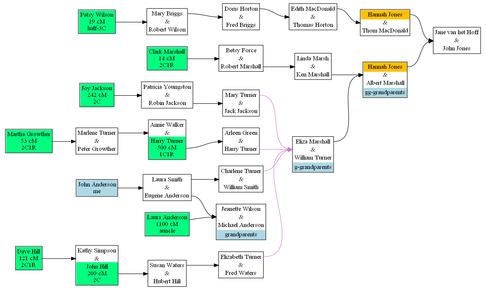

# draw-dna-matches.py

A program that can help with viewing DNA matched family members.

## Features

- Output is a [Graphviz](https://graphviz.org) DOT file.
- Makes use of [readgedcom.py](https://github.com/johnandrea/readgedcom) library.

## Limitations

- Requires Python 3.6+
- Might fail if the closest matched person does not have parents in the data file.

## Installation

No installation process. Copy the program and the library.

## Input

The input is a GEDCOM file exported from a genealogy program. The key is that the DNA matches are marked in a custom event whose name is an input option. The match cM value will be extracted if found in that event's note field and will be
displayed below the person's name. The cM value in the note can be given as only a single number, or else it must be a number followed by cM. Such as "62", "123cm", "text 123 cm", "1,234 cM", etc. However "text 321 text" will not match.

An example of a relevant portion of the input file:

```
1 EVEN
2 TYPE dnamatch
2 NOTE matched at 732 cM
```

The matches are intended to be made against one person in the data file. That person
is identified by an event note which begins with the string "Me," or "me,".

```
1 EVEN
2 TYPE dnamatch
2 NOTE Me, matching others
```

By changing the internal program variable value of EVENT_ITEM to 'value' those sections should be similar to:

```
1 EVEN 732 cM
2 TYPE dnamatch
```

and

```
1 EVEN me, start person
2 TYPE dnamatch
```

## Options

event-name

The name of the custom event in which the data is stored. The examples above use "dnamatch".

gedcom-file

Minimum match value (cM) to include in the output. Default 0.

--min=value

Maximum match value (cm) to include in the output. Default 5000.

--max=value

Output as a DOT file for creating a display with Graphviz. This is the default.

--format=dot

Output as a GEDCOM file for import into another program. A minimal amount of data is copied into the output. 

--format=gedcom

The full path to the input file.

--libpath=relative-path-to-library

The directory containing the readgedcom library, relative to the . Default is ".", the same location as this program file.


## Display

In the produced graphs, each dnamatch person will be shown in a green box. Any person which has multiple families will be in an orange bordered box. Any family with 3 or more incoming connections will have coloured input arrows.

## Example



## Usage

```
draw-dna-matches.py  dnamatch  family.ged  >out.dot  2>out.err
graphviz -Tpng out.dot -o out.png
graphviz -Tsvg out.dot -o out.svg
```

Example usage if readgedcom.py is in a parallel directory

```
..\draw-dna-matches.py --libpath=..\codecopy  dnamatch  family.ged  >out.dot  2>out.err
```

## Bug reports

This code is provided with neither support nor warranty.

### Future enhancements

- Handle non_ASCII names in a manner better for SVG output.
- Handle family matched above the tree top.
- Output to other formats (Cytoscape, etc.)
