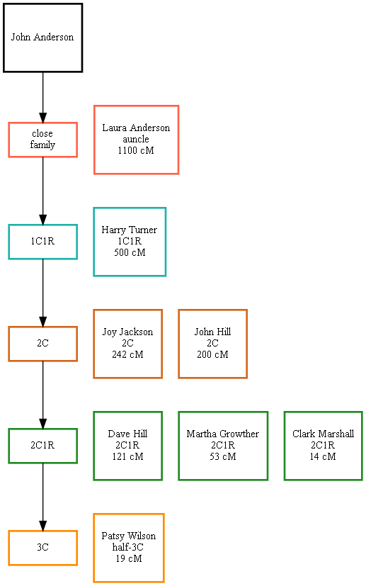

# draw-dna-matches.py

A program that can help with viewing DNA matched family members.

## Features

- Output is a [Graphviz](https://graphviz.org) DOT file.
- Makes use of [readgedcom.py](https://github.com/johnandrea/readgedcom) library.

## Limitations

- Requires Python 3.6+
- Won't draw path if closest ancestor is not in the data file
- Double-cousins and other multiple relationships are shown in only one path. Direct relationships are selected over half relationships.
- Assumes that non-birth family connections are marked as such in the data. Requires readgedcom version 1.20+

## Installation

No installation process. Copy the program and the library.

## Input

The input is a GEDCOM file exported from a genealogy program. The key is that the DNA matches are marked in a custom event whose name is an input option. The match cM value will be extracted if found in that event's note field and will be
displayed below the person's name. The cM value in the note is a number at the start of the line followed by space and "cM" or "cm", such as "62 cM", "123 cm", "1,234 cM", etc. A floating point number can be used, such as "123.7 cM", but it will be rounded.

An example of a relevant portion of the input file:

```
1 EVEN
2 TYPE dnamatch
2 NOTE 732 cM, a cousin
```

The matches are intended to be made against one person in the data file. That person
is identified by an event note which is "Me" or begins with "Me ", "me." or "me," (case independant).

```
1 EVEN
2 TYPE dnamatch
2 NOTE Me, matching others
```

By setting the option "--eventtype=value" those sections should be similar to:

```
1 EVEN 732 cM
2 TYPE dnamatch
```

and

```
1 EVEN me. The start person
2 TYPE dnamatch
```

## Options

event-name

The name of the custom event in which the data is stored. The examples above use "dnamatch".

gedcom-file

Full path to the input file.

--version 

Display the version number then exit

--min=number

Minimum match value (cM) to select for output. Only integer values are allowed. Default 0.

--max=number

Maximum match value (cm) to select for output. Only integer values are allowed. Default 5000.

--format=tree

Output as a DOT file for creating a display with Graphviz as a tree connecting match people to ancestors. This is the default.

or use
--format=matrix

Output as a DOT file for Graphviz to make a simple display of DNA matches grouped by match size and relationship.

or use
--format=gedcom

Output as a GEDCOM file for import into another program. A minimal amount of data is copied into the output. 

--eventtype=type

Set the type of of data containing the DNA match values. See above GEDCOM file examples. Either 'value' or 'note'. Default is 'note'.

--relationship

Show relationship name (sibling, parent, 1C, 2C1R, etc.) with person names. Relationships are computed from paths in the tree, 
dna values are not involved. Default is none.

--title="text"

Display a title on the output chart. Default is no title.

--placetitle=location

Set the location of the title using "tc", "tl", "tr", "bc", "bl", "br" for top-center, top-left, top-right, bottom-center, bottom-left, bottom-right. The default is "tc" for top-center.

--reverse-arrows

Reverse the order of the arrows between parents and children. Default is from children to parents. Only relevant for format=tree.

--orientation=direction

Set the orientatation of the diagram in the DOT file output. Default is "LR" for left-to-right.
Other choices are "TB" for top-to-bottom, plus "BT" (bottom-top), and "RL" (right-left). Only relevant for format=tree.

--shortname

Use only the first word from a given name (if "givn" part exists) in order to make a smaller graph without middle names and initials.
Default is to not use this option. Not relevant for format=gedcom.

--thick

Increase the size of the connecting lines in format=tree. Can be included multiple times for extra thickness.

--libpath=directory-containing-readgedcom

Location containing the readgedcom.py library file. The path is relative to the program being used. An absolute path will not work. Default is the same location as the program (".").


## Display

In the produced graphs, each DNA match person will be shown in a green box. Any person which has multiple families will be in an orange box. Any family with 3 or more incoming connections will have coloured input arrows.

## Example


Using the format=matrix option



## Usage

```
draw-dna-matches.py  --relation  dnamatch  family.ged  >out.dot  2>out.err
graphviz -Tpng out.dot -o out.png
graphviz -Tsvg out.dot -o out.svg
```

Or to show only distant relatives
```
draw-dna-matches.py  --relation --max=800  dnamatch  family.ged  >out.dot  2>out.err
graphviz -Tsvg out.dot -o out.svg
```

To make a similar matrix display.
```
draw-dna-matches.py  --format=matrix --max=800  dnamatch  family.ged  >out.dot  2>out.err
graphviz -Tsvg out.dot -o out.svg
```

Or to make a new gedcom from the matches and common ancestors

```
draw-dna-matches.py  --format=gedcom  dnamatch  family.ged  >matches.ged
```

Example usage if readgedcom.py is in a parallel directory

```
draw-dna-matches.py --libpath=..\codecopy  dnamatch  family.ged  >out.dot  2>out.err
```

with title placed in bottom-left
```
draw-dna-matches.py --libpath=..\codecopy --title="My DNA matches" --place="bl"  dnamatch  family.ged  >out.dot  2>out.err
```


## Bug reports

This code is provided with neither support nor warranty.

### Future enhancements

- Come up with a compact style which can connect each person's multiple marriages.
- Handle non-ASCII names in a manner better for SVG output.
- Handle family matched above the tree top.
- Output to other formats (Cytoscape, etc.)
